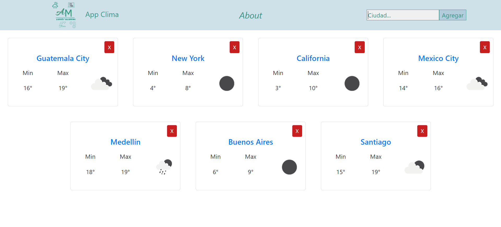
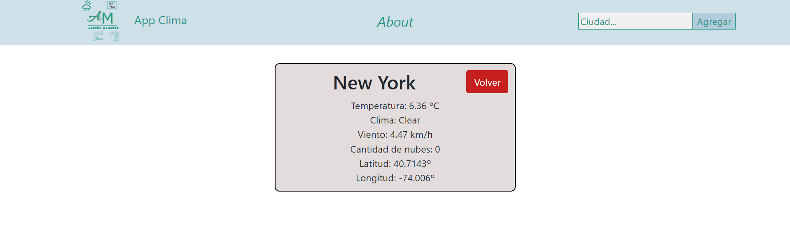

# App Clima

Esta aplicacion hace uso de React Router, state en react asi como peticiones a la API de Open Weather para obtener la informacion que se muestra

## Descripción 

Dentro de la aplicacion encontramos una barra de busqueda en la cual ingresamos el nombre de la ciudad de la cual queremos aber el pronostico del clima, podemos añadir tantas ciudades a nuestra home page como deseemos  

asi como podemos ver más detalles de la predicción del clima para la ciudad haciendo click sobre el nombre de la ciudad en su respectiva tarjeta

## Instalacion 

Realizar **npm install** en la carpeta del proyecto, para bajar las dependencias necesarias, cuando la instalacion termine inicializar con **npm start**